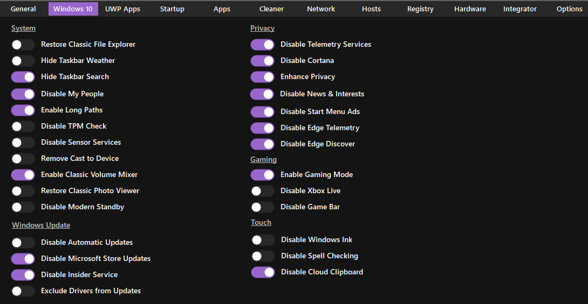
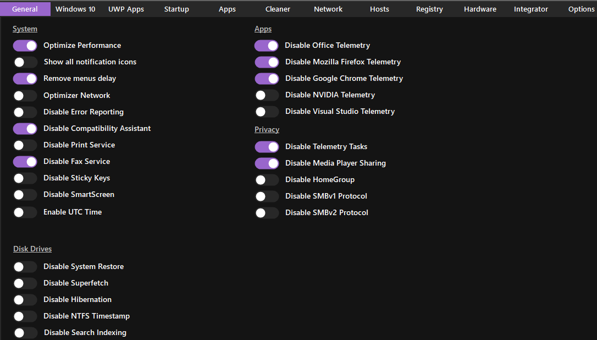

# 🖥️ New Laptop Setup Guide
> Optimization guide for Zephyrus G14 (2021, R9 + 3060)

## 📋 Table of Contents
1. [Initial Setup](#initial-setup)
2. [Essential Tools](#essential-tools)
3. [System & Power Tweaks](#system--power-tweaks)
4. [ROG Laptop Optimization](#rog-laptop-optimization)
5. [Privacy & De-bloating](#privacy--de-bloating)
6. [References](#references)

---

## Initial Setup

### Windows IoT LTSC Installation
1. **Download Required Tools**
   - Get Windows IoT LTSC ISO from [massgrave.dev/windows_ltsc_links](https://massgrave.dev/windows_ltsc_links) (Windows 10 bcs F U Microsoft)
   - Download Rufus from [rufus.ie](https://rufus.ie/)

2. **Create Installation Media**
   - Insert USB drive (8GB+)
   - Open Rufus
   - Select USB and IoT LTSC ISO
   - Choose GPT partition scheme
   - Click Start

3. **Install Windows**
   - Boot from USB (usually `F2` or `Esc`)
   - Choose "Offline Account" during setup
   - Complete installation
   - Update Windows

---

## Essential Tools

### 1. Performance & System Tools
- **G-Helper** ([Download](https://github.com/seerge/g-helper))
  > Replaces Armoury Crate - lighter, better performance control
  

- **Nvidia Drivers** ([Download](https://www.nvidia.com/Download/index.aspx))
  > Latest Studio drivers recommended

### 2. System Optimization
- **Winaero Tweaker** ([Download](https://winaero.com/winaero-tweaker/))
  > My settings: [references/WinAeroTweaker.ini](References/WinaeroTweaker.ini)

- **Optimizer** ([Download](https://github.com/hellzerg/optimizer/releases))
  <details>
  <summary>View recommended settings</summary>
  
  
  
  </details>

---

## System & Power Tweaks

### Advanced Power Management
```powershell
# Show hidden power options
powercfg -attributes SUB_PROCESSOR 893dee8e-2bef-41e0-89c6-b55d0929964c -ATTRIB_HIDE
powercfg -attributes SUB_PROCESSOR 75b0ae3f-bce0-45a7-8c89-c9611c25e100 -ATTRIB_HIDE

# Set optimal power states
powercfg /setacvalueindex SCHEME_CURRENT SUB_PROCESSOR PROCTHROTTLEMIN 1
powercfg /setacvalueindex SCHEME_CURRENT SUB_PROCESSOR PROCTHROTTLEMAX 99
powercfg /setacvalueindex SCHEME_CURRENT SUB_PROCESSOR PERFBOOSTMODE 0
powercfg /setactive SCHEME_CURRENT
```

### Performance Modes
- **0** = Disabled (Best for thermals, what I use)
- **1** = Enabled
- **2** = Aggressive
- **3** = Efficient Enabled
- **4** = Efficient Aggressive

---

## ROG Laptop Optimization

1. **Remove Armoury Crate**
   - Uninstall via Settings
   - Disable services in `services.msc`

2. **Install G-Helper**
   - Download from GitHub
   - Run in balanced mode
   - Enable optimizations

3. **System Cleanup**
   ```powershell
   # Remove OneDrive
   winget uninstall Microsoft.OneDrive

   # Run de-bloat script
   iwr -useb https://git.io/debloat|iex
   ```

---

## References

### 📁 Configuration Files
- [WinAeroTweaker.ini](https://github.com/r0dok/new-laptop-notes/blob/main/References/WinaeroTweaker.ini)
- [Optimizer.zip](References/Optimizer.zip)

### 🔧 Recommended Settings
<details>
<summary>View all screenshots</summary>

#### Optimizer Settings



#### Other Tools

</details>

---

## Notes
- Keep all software updated, FFS
- Disable mouse accel.
